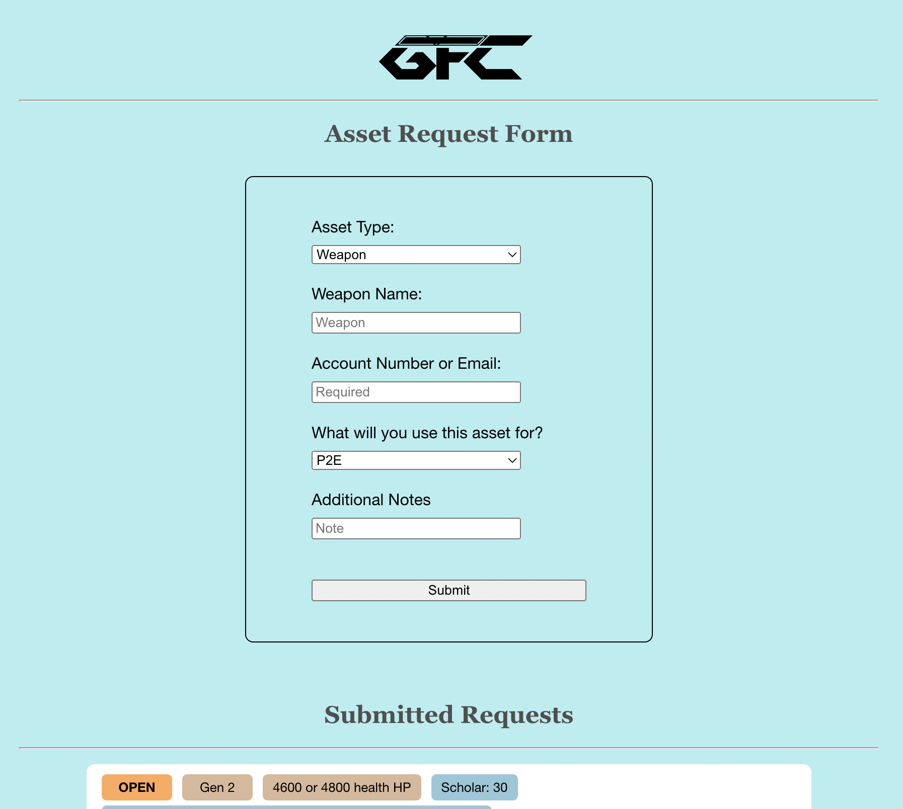

# Asset Requesting App
Website: [https://gfi-asset-request.herokuapp.com/](https://gfi-asset-request.herokuapp.com/)

Sample Login Username/Password: test/hydrate

## Summary
 
I am the head of Galaxy Fighters International (GFI), an NFT gaming guild in (Galaxy Fight Club)[https://galaxyfightclub.com/]. Within this guild, my 20+ scholars borrow NFT assets such as weapons and fighters to play the game. They often have requests for different weapons, and I needed a system to manage their requests. To do this, I created an application where they can sign in to submit and cancel requests to borrow assets, and I can manage the requests by marking them as completed, rejected, or adding comments.

## Project Specs
- each scholar can sign in to app and submit requests
- each scholar can view their submitted requests and their current status, and cancel requests if needed
- admin can sign in to app and see all requests
- admin can accept, reject, delete, and comment on requests

## Skills Demonstrated
While the internal logic here is quite simple, it is a comprehensive application that involved the use of a variety of full stack tools:
- Building a mobile-friendly front end for the app using ReactJS, HTML, CSS.
- Running a server using Socket.IO in NodeJS to authorize sign-ins and communicate with the database
- Deploying the application live using Heroku
- Using a MySQL database on Amazon RDS to store and update submitted requests

## Potential Improvements
As this project was created as a quick internal tool, there are several pitfalls left in the app that could be points of learning for me in the future.
- No password security. After some basic research it appears that sending plain-text passwords over HTTPS should be a-ok, but my app has no sort of rate limit protection or captcha to prevent spammers.
- No email/account reset integration. Currently account creation is done purely by me, and scholars will need to go through me in order to reset their credentials. If I were to scale this operation up, some sort of automated account management would be desired.
- Few server protections. Admittedly, villains sending bad data would be able to crash my server if they tried. Adding rate limits and checking size/type of data on the server would be necessary for a consumer app. Luckily Heroku has good logging, so if unexpected errors did come up I would be able to fix the issue.

Time spent on project: 10 hours over 2 days.
