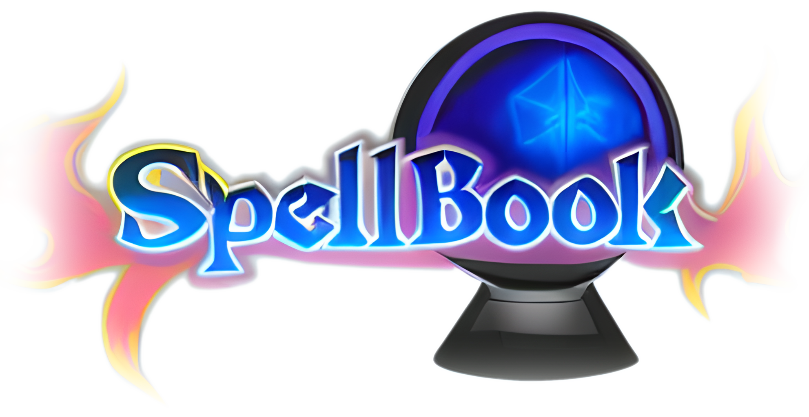
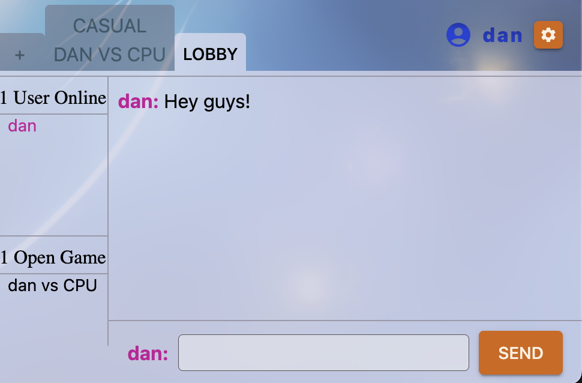
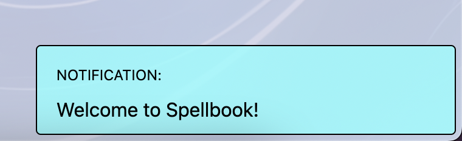
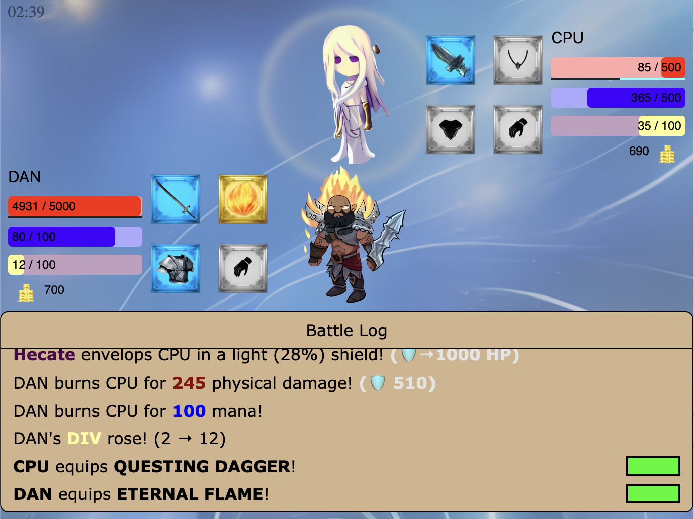
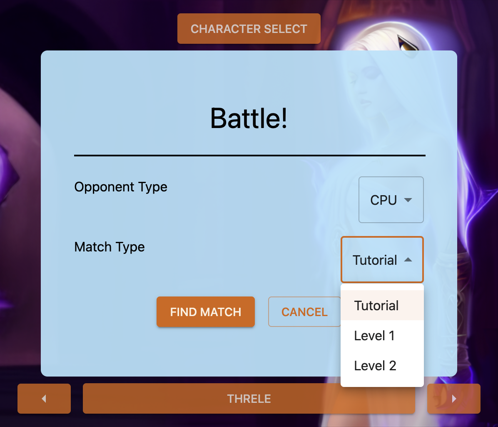

# Spellbook: Demo
Website: [https://spellbookdemo.herokuapp.com/](https://spellbookdemo.herokuapp.com/)

## Summary
 
This project puts my MERN stack knowledge and Stable Diffusion creative abilities to the test! My vision is to create a multiplayer online game that
involves real time strategy and coherent, fantasy graphics. I also wanted to give the UI a Pokemon Showdown style feel, where the player can join a lobby
to chat with other players, send friendly challenges, and spectate games. This is my capstone project for my Javascript learning--tying everything I've learned together in one beautiful
application

## Project Specs
- Create a site with a Navbar, a Character Select page, and a Welcome page
- Allow Battles and Chat Rooms to be opened up as extra tabs, and create a tab UI to allow for switching and closing tabs
- Allow users to create a Username to find battles/chat/record scores, and allow users to later attach a password to their account
- Create the actual gameplay!
  - Gameplay revolves around searching through a variety of spells and casting them to beat your opponent. Create a search bar with intelligent autocomplete and
intuitive navigation through typing, arrow keys, numbers, tab, and enter.
  - Display character sprites, stat bars, and equipment. Add animations to spice up the actions
  - Use proper state management across clients and server
- Create CPUs with prebuilt strategies for single player games
- Using my own creative tools (Stable Diffusion AI and GIMP for editing), generate *all* graphics for the game! Including characters, equipment, logos, and
backgrounds.

## Process
This is the largest project I've undertaken by myself. In total I built about 40 React components, synthesized 50 game sprites, 
and created 10 pieces of equipment and 13 spells!

### Step 1, UI design
 
My first step was to create the front end website. After mocking out the interface in Figma, I built the primary components in React with the Material UI package that I'm now quite familiar with. Once the elements were built, I added some flair by using Stable Diffusion to create graphics such as the character portraits, logo, and background. Creating finished graphics this early also served to give me some thematic guidelines for how I'll design the movesets for characters later on. I'm also learning Stable Diffusion on the fly as prompt engineering is a very new field, and using tutorials and experimenting to discover new techniques.

### Step 2, Server authentication, Socket creation
Similar to the blog that I created in the past, Spellbook allows users to authenticate via username/password to receive a token to add in requests. Unlike the blog, however, users can also submit only a username. This is easily managed on the server by simply saving usernames to MongoDB without a password. One other important difference is the inclusion of a websocket! Users in the chat room and playing the game need to communicate using a socket instead of rest. Passing the authentication token to verify users via websocket works seamlessly, and allows me to explore the workflow to add new websocket actions in the future.

### Step 3, Chat room
 
Before building the actual game, I built a chat room on the website for users to talk. This will be an important function of the app, and also lets me practice working with the websocket futher. Using knowledge from past tutorials, I designed a chat room state to maintain on the server side, and methods to pass either the whole state or just deltas to the client, depending on whether they are just connecting, or already connected and listening for updates. Clients also have the ability to pass in updates to the state, which simply consists of joining/leaving the room or sending messages. When I build the game later, I'll essentially be building a glorified chat room that also manages a state on the server, communicates state with the client, and displays state via graphics and text.

### Step 4, Notifications
I'm using React Redux to manage state on the client side, and pop up notifications is both a fun way for me to visualize state changes and report them to the user. 
 
Though not originally planned, I added some neat notifications that appear above the main application. I'm even able to reuse the X button component that I designed for my tabs, which only appears when its parent is hovered.

### Step 5, Game Time! Front End
The main "game" is really a visualization of the underlying game state, which consists of two characters, their current stats, and their current actions. I envisioned this to look similar to a Pokemon battle, with their sprite and stat bars. Each component is responsible for displaying part of the state, and by passing the full state of the game into the outer battle container, all components will update to the current state. I also build the search bar in this step, with custom events overwriting the functions of some keys like the numbers, tab, and enter.

### Step 6, Game Time! Back End
At the same time, I also need to build the proper data structures and logic to update them on the server end. This is easy enough, since the game state only consists of two players (think Pokemon). The game loop itself consists of checking a queue of actions, and broadcasting the updated state after actions are processed. To help users play in real time, clients will also receive the pending actions, so that they can process at the same time as the server and update the state. Actions are abstracted into lists of "effects", so that the only file needed to handle action logic simply contains a method to apply every effect in the game. This is anything from "deal damage", to "consume mana", to "equip weapon". I'm also making sure to use enums instead of strings for game mechanics like "fire"/"shadow" type or "priest" class.

### Step 7, Game Time! Character and Graphic Design
 
Creating the character portraits at the start is one thing, but putting my vision of them into actual video game moves is another. This step was purely creative and a ton of fun. I already had a vision for how my two characters, warrior Chaze and priest Threle, would work mechanically. My workflow involved feeding Stable Diffusion prompts, editing in GIMP, and using results to get more inspiration for more moves and styles. I would iterate between steps 5-7 until the entire game was created. The latter half of the work involved creating animations for moves, which on the front end simply means creating new components to display state in different ways. On the creative side, I took inspiration from hit animations from games that I've played, and used SD to create satisfying hit effects for my characters.

### Step 8, Game Joining and Completion
 
Now that the characters can equip gear and cast spells at each other, it's time to manage different scenarios around games being created. On the client side, this means handling the various ways a game can be joined--finding a CPU or random player match, or going into the Lobby to make a friendly challenge or simply spectate existing games. On the server, this means handling edge cases around the game--handling reconnections, terminating the game when a player wins, or when games last too long/all players have disconnected.

### Step 9, Bots, Balance, Wrapping Up
The game is pretty much complete, but is it fun and engaging? In order to test this, I first created CPUs of varying difficulty to execute strategies that I had in mind. By playing against them I was able to make some good balance changes, before unleashing the game on my friends and watching their reactions. From their experience, I'm happy to say the game is quite balanced! I only needed to make some polish to certain aspects of the user interface, and that made for a complete game. Nice!

Time spent on project: 200 hours over 40 days. Whew!

